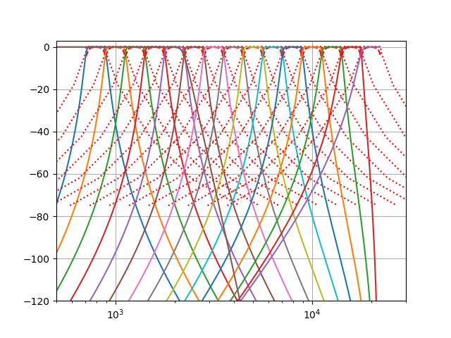

# FilterDesign
Filter Design in python

Intended to be used with [The SonoMKR Project](https://github.com/SonoMKR/sonomkr-core)

The filters are IIR exported as Second Order Sections
Filters respect the IEC 61260-1 class 0 specifications

## INSTALL

`pip install numpy matplotlib scipy`

## TODO

- [x] make sure base-10 antialiasing is correct for signal decimation by 10 strategy
- [x] make sure 1/3 Octaves are OK
- [ ] make sure base-2 antialiasing is correct for signal decimation by 2 strategy
- [ ] make sure 1/1 Octaves are OK
- [ ] add Nth Octave bands (1/N octaves)